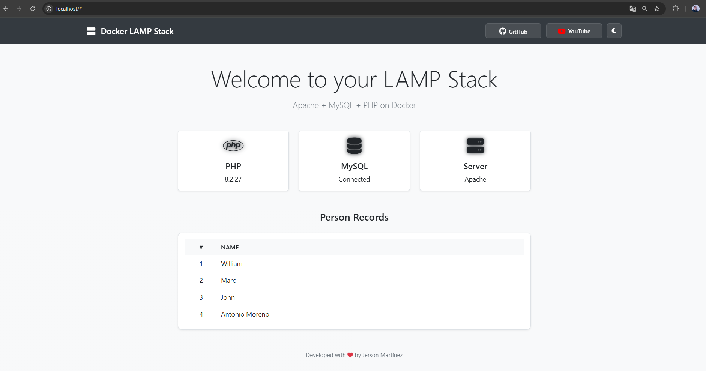
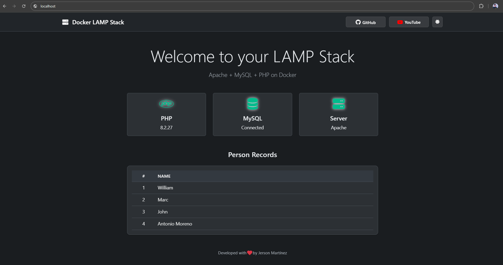
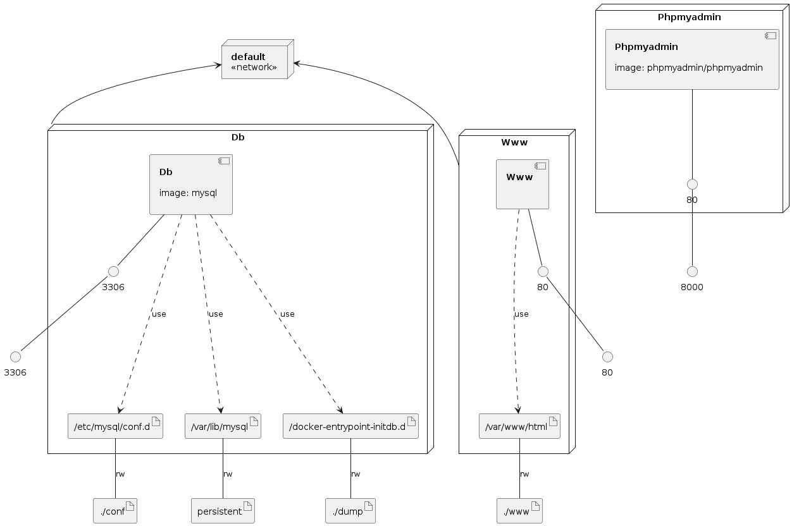

# Docker LAMP Stack

[](https://github.com/jersonmartinez/docker-lamp/stargazers)
[](https://github.com/jersonmartinez/docker-lamp/network/members)
[](https://github.com/jersonmartinez/docker-lamp/issues)
[](https://github.com/jersonmartinez/docker-lamp/blob/main/LICENSE)

A modern and efficient LAMP stack (Linux, Apache, MySQL, PHP) development environment using Docker. Perfect for PHP development with a clean, easy-to-use interface and dark mode support.

## 🎨 Interface Themes

| Light Mode | Dark Mode |
|------------|-----------|
|  |  |

## 📺 Quick Overview

Watch the tutorial video to get started:

[](https://youtu.be/v-r_12oezds)

## 🏗 Infrastructure Model



## 🚀 Features

- **Easy Setup**: Get started with a single command
- **Modern Interface**: Clean UI with dark/light mode support
- **Real-time Status**: Monitor your services at a glance
- **Database Management**: Includes PHPMyAdmin for easy database administration
- **Development Ready**: Perfect for PHP projects with MySQL
- **Customizable**: Easy to modify environment variables and configurations

## 📋 Prerequisites

- [Docker](https://www.docker.com/get-started)
- [Docker Compose](https://docs.docker.com/compose/install/)

## 🛠 Quick Start

1. Clone the repository:
   ```bash
   git clone https://github.com/jersonmartinez/docker-lamp.git
   cd docker-lamp
   ```

2. Copy the environment file:
   ```bash
   cp .env.example .env
   ```

3. Start the containers:
   ```bash
   docker-compose up -d
   ```

4. Access the services:
   - Web Interface: [http://localhost](http://localhost)
   - PHPMyAdmin: [http://localhost:8080](http://localhost:8080)

## 🔧 Configuration

### Environment Variables

Edit the `.env` file to configure:

```env
MYSQL_ROOT_PASSWORD=your_root_password
MYSQL_DATABASE=your_database
MYSQL_USER=your_user
MYSQL_PASSWORD=your_password
```

### Service Versions

- PHP: 8.2
- MySQL: Latest
- Apache: 2.4
- PHPMyAdmin: Latest

## 📁 Project Structure

```
docker-lamp/
├── .env                 # Environment variables
├── docker-compose.yml   # Docker services configuration
├── www/                 # Web root directory
│   ├── index.php       # Main application file
│   ├── assets/         # CSS, JS, and other assets
│   └── includes/       # PHP includes
└── README.md           # This file
```

## 🔨 Development

### Adding PHP Extensions

1. Edit the `Dockerfile`:
   ```dockerfile
   RUN docker-php-ext-install pdo pdo_mysql
   ```

2. Rebuild the containers:
   ```bash
   docker-compose build
   docker-compose up -d
   ```

### Database Management

- Access PHPMyAdmin at [http://localhost:8080](http://localhost:8080)
- Default credentials:
  - Server: db
  - Username: root
  - Password: (from .env file)

## 📚 Documentation

For more detailed information, check out:
- [Docker Documentation](https://docs.docker.com/)
- [PHP Documentation](https://www.php.net/docs.php)
- [MySQL Documentation](https://dev.mysql.com/doc/)

## 🤝 Contributing

1. Fork the repository
2. Create your feature branch (`git checkout -b feature/AmazingFeature`)
3. Commit your changes (`git commit -m 'Add some AmazingFeature'`)
4. Push to the branch (`git push origin feature/AmazingFeature`)
5. Open a Pull Request

## 📝 License

This project is licensed under the MIT License - see the [LICENSE](LICENSE) file for details.

## 👨‍💻 Author

**Jerson Martínez**
- GitHub: [@jersonmartinez](https://github.com/jersonmartinez)
- YouTube: [Watch Tutorial](https://www.youtube.com/watch?v=v-r_12oezds)

## ⭐ Support

If you find this project helpful, please give it a star on GitHub and share it with others!